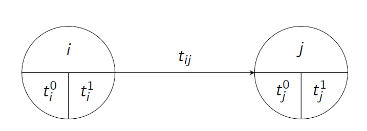

```{r setup, include = FALSE}
knitr::opts_chunk$set(
  collapse = TRUE,
  comment = "#>"
)
```

There are two approaches in project management to present multifunctional projects on a graph:

1. Activity on the Arc (AoA) notation, where each arrow (edge) means an activity. Nodes determine the start or end of one or more activities.
2. Activity on the Node (AoN) notation, in which the node denotes an activity. Arrows represent the relationships between given activity and the activities immediately preceding and immediately following it.

The current version of the package uses the AoA notation.

## The Critical Path Method

In the CPM (Critical Path Method) we assume that the duration of each activity is exactly known (deterministic).

Let's take the AoA notation. The activity starts at node number $i$ and ends at node number $j$. The whole project begins and ends in one node. Let's look at the figure below. Starting and ending moments differs because activities may occur in parallel and serially within one project. Besides, activities will vary in duration.

{width=50%}

$t_{i}^{0}$ - the earliest possible start time of the task $i$;

$t_{i}^{1}$ - the latest possible start time of the task $i$;

$t_{j}^{0}$ - the earliest possible completion time of the task $j$;

$t_{j}^{1}$ - the latest possible completion time of the task $j$.

The moment of completing the entire project is called the directive term. CPM analysis can be divided into the following stages:

1. Setting the earliest times for tasks.
2. Setting the latest times for tasks.
3. Determining slacks for activities.
4. Preparation of the project schedule.
5. Determining the critical path of the project.

Additionally, we can make a Gantt chart and ASAP (As Soon As Possible) and ALAP (As Late As Possible) charts.

The preparation of a project schedule consists in determining all possible starting and completion times for the activities. In addition, we calculate a total float time (total slack) for each activity. During this time, the activity can be delayed without delaying the completion of the entire project. 

Let's denote:

$ES_{ij}=t_{i}^{0}$ - the earliest possible start time of the activity $(i,j)$;

$LF_{ij}=t_{i}^{1}$ - the latest permitted completion time for the activity $(i,j)$;

$LS_{ij}=LF_{ij}-t_{ij}$ - the latest permitted start time for the activity $(i,j)$;

$EF_{ij}=ES_{ij}+t_{ij}$ - the earliest possible completion time of the activity $(i,j)$;

$TS_{ij}=LF_{ij}-ES_{ij}-t_{ij}$ - total slack of time (total float) for activity $(i,j)$. A reserve of time that can be used to perform a given activity without affecting the completion time of the project.

$FS_{ij}=t_{j}^{0}-t_{i}^{0}-t_{ij}$ - free slack of time (free float) for activity $(i,j)$. Maximum amount of time by which an activity can be delayed without delaying the earliest possible start time of any following activity.

$CS_{ij}=t_{j}^{1}-t_{i}^{1}-t_{ij}$ - conditional slack of time for activity $(i,j)$. Maximum amount of time by which an activity can be delayed without delaying without affecting time slacks of activities preceding the activity (lying on the same path).

We assume that the directive term (DT) equals to the earliest time of the final event $\left(DT=t_{n}^{0}\right)$ so the slacks for critical activities equal to zero. Extension of the duration of any critical activity by $\tau$ time units will postpone the completion time of the entire project by $\tau$ units.

If we assume that $DT>t_{n}^{0}$ then extension of the duration of any critical activity by $\tau$ time units will postpone the completion time of the entire project by $\tau-\left(DT-t_{n}^{0}\right)$ units for $\tau>\left(DT-t_{n}^{0}\right)$. Smaller delays do not affect the duration of the entire project.

## Example of CPM analysis in the *critpath* package

**Notice!**

The *critpath* requires additional packages to be installed. The required packages are *DiagrammeR*, *ggplot2* i *reshape2*.

Let us look at a small example of a project in which the durations of activities are known and predetermined. The table below provides information on the structure of the graph and the duration of activities in some example project. The same dataset is available in the *critpath* package as  *cpmexample1*.

```{r, echo = FALSE}
from <- c(1, 1, 1, 2, 3, 4)
to <- c(2, 3, 4, 4, 4, 5)
label <- c("A", "B", "C", "D", "E", "F")
time <- c(3, 2, 5, 1, 1, 3)
knitr::kable(cbind(as.numeric(from), to, label, time), col.names = c("Start. node", 
                                                         "End. node",
                                                         "Name",
                                                         "Duration"),
             align = "cccc", caption = "Tab. 1. Data for the CPM model")
```

We will perform the following analyzes:

- making a graph of connections between activities,
- finding the start and end times of all activities,
- indicating the bottlenecks of the project (critical activities),
- puting critical activities on the graph,
- making a Gantt chart,
- making ASAP and ALAP charts.

Usually we know what the graph looks like before solving the project management problem but let's assume that at the moment we don't. With the help of the *plot_graphAOA()* function we will create a graph based on the data from Table 1. The function takes two arguments: 
data frame with ... well, data and whether the durations are deterministic.

The data frame should have the same structure as in Table 1. The order of the columns is important, not their names. The first two columns contain the numbers of the starting and ending nodes. The next column contains the names of activities and the last one times of their duration. All package functions that use the data frame as an argument must keep this structure.

```{r, echo = FALSE, include = FALSE}
library(critpath)
plot_graphAOA(cpmexample1)
```

```{r, fig.align = 'center'}
plot_graphAOA(cpmexample1)
```

The next two items from the list above are performed by the *solve_pathAOA()* function. It creates the schedule of the project and requires two arguments: data frame prepared according to the scheme described above and a logical argument indicating what kind of duration (deterministic or stochastic) we are dealing with. 

```{r}
x <- solve_pathAOA(cpmexample1, deterministic = TRUE)
```

After the calculations are completed, a message is displayed with the directive term. The result of the *solve_pathAOA()* function is saved to the list. Its elements vary slightly depending on the type of method used. For the CPM, these will be:

1. A saved graph created with a *DiagrammeR* package.
2. The schedule of the project.
3. Project completion time.
4. List of critical activities.
5. A table with free float and conditional float values.

Operator "[" returns objects of the list type. In turn, the operator "[[" allows you to access the value of a specific list item.

```{r}
# Schedule
x[2]
# Directive term
x[3]
# Critical activities
x[4]
# Free float and conditional float values
x[5]
```

The first element of the list *x* is used by other functions in the package. Asterisks in the last column of the schedule indicate which activities are critical.

Now, let's draw a graph with the critical activities marked. We will use the *plot_crit_pathAOA()* function. It takes one argument - a list created after solving the problem. 

```{r, fig.align = 'center'}
plot_crit_pathAOA(x)
```

The next element of the CPM analysis will be the Gantt chart. The *plot_gantt()* function requires the *ggplot2* and *reshape2* packages to be installed first. It also takes the list produced by the *solve_pathAOA()* function as a mandatory argument. Optional argument *bar_size* determines the thickness of the bar of the drawn activity. The default is 10, and if appropriate, this argument need not be provided.

```{r, fig.align = 'center', fig.width = 6, fig.cap = "Gantt chart"}
plot_gantt(x)
```

The activities are displayed in the order they were entered. The critical ones are marked with *CR* and the non-critical ones with *NC*. Additionally, slacks greater than zero have been added for non-critical activities.

Based on the Gantt chart we can plot two more charts. The first one is the ASAP chart which shows effetcs of starting activity as early as possible and end it as early as possible. It can be achieved withe the *plot_asap()* function.

```{r, fig.align = 'center', fig.width = 6, fig.cap = "ASAP chart"}
plot_asap(x)
```

On the other hand, the ALAP chart shows effetcs of starting activity as late as possible and end it as late as possible. It can be achieved withe the *plot_alap()* function.

```{r, fig.align = 'center', fig.width = 6, fig.cap = "ALAP chart"}
plot_alap(x)
```

## The PERT method

The abbreviation PERT stands for Program Evaluation and Review Technique. This method is based on the following assumptions:

- Activity durations are assumed to have Beta distribution with expected values $E\left(t_{ij}\right)$ and standard deviations $D\left(t_{ij}\right)$.
- The following restrictions apply to the distribution of the activity duration,ie. on the density function $f\left(t_{ij}\right)$:
  * the duration of the activity is within the range $\left\langle t_{ij}^{a},t_{ij}^{b}\right\rangle$. We assume that the probability of the performance of the activity (\emph{i,j}) in less than $t_{ij}^{a}$ or longer than $t_{ij}^{b}$ units is zero;
  * the parameters of the Beta function ensure that the probability distribution of the activity duration is a right-hand asymmetric.

Experts estimate the duration of individual activities. As a result, we get:

- $t_{ij}^{a}$ \textendash{} optimistic duration of activity (\emph{i,j});
- $t_{ij}^{b}$ \textendash{} pessimistic duration of activity (\emph{i,j});
- $t_{ij}^{m}$ \textendash{} the most likely duration of the activity (\emph{i,j}).

The PERT time analysis begins with the introductory phase, which involves estimating the expected value and duration variance for each activity.

Expected duration of the activity (\emph{i,j}):
\[
m_{ij}=\frac{t_{ij}^{a}+4t_{ij}^{m}+t_{ij}^{b}}{6}
\]
 Variance of activity (\emph{i,j}) duration :
\[
s_{ij}^{2}=\left(\frac{t_{ij}^{b}-t_{ij}^{a}}{6}\right)^{2}
\]

The calculations in the stochastic problem are analogous to the deterministic (CPM) except that we now use the expected durations instead of the fixed durations.

The classical PERT approach uses the central limit theorem. This theorem states that the sum (difference) of a large number of independent random variables with the same distribution has an asymptotically normal distribution.

The chance of meeting the expected directive term (\emph{DT}) equal to the earliest time of occurence for the last activity ($t_{n}^{0}$) is 50%.

In the PERT method, it is assumed that the \emph{DT} should be selected in such a way that its probability would be between 30% and 60%: 

\[
0{,}3 \leqslant P\left(t_{n}<DT\right)\leqslant 0{,}6
\]

A schedule with less than 30% chance of realization is called the risk taker's schedule, and the one with more than 60% chance is called the belayer's schedule.

## Example of PERT analysis in the *critpath* package

We will use a different data than in CPM. This data is available in a set named *pertexample1*. Let us assume that the duration of activities are random and described with three numerical values as in Table 2.

```{r, echo = FALSE}
from <- c(1, 2, 3, 3, 3, 4, 5, 6, 7)
to <- c(2, 3, 4, 5, 6, 7, 7, 7, 8)
label <- c("A", "B", "C", "D", "E", "F", "G", "H", "I")
opt_time <- c(3, 5, 5, 1, 6, 2, 5, 3, 4)
likely_time <- c(5, 7, 5, 6, 8, 6, 6, 5, 6)
pes_time <- c(7, 9, 8, 8, 10, 7, 7, 7, 8)
knitr::kable(cbind(as.numeric(from), to, label, opt_time, likely_time, pes_time), 
             col.names = c("Start. node", "End. node", "Name", "Opt. time", 
                           "Most like. time", "Pess. time"),
             align = "cccccc", caption = "Tab. 2. Data for the PERT model")
```

We are interested in the following types of analyzes:

- determining the start and end times for each activity,
- identifying the bottlenecks of the project (critical activities),
- placing critical activities on the graph,
- making a Gantt chart,
- making ASAP and ALAP charts,
- indication of directive terms for the risk-taker and the belayer schedules.

Duration is a random variable, so we will change the *deterministic* argument to *FALSE*.

```{r}
y <- solve_pathAOA(pertexample1, deterministic = FALSE)
```

After solving the problem, a message appears giving the parameters of the normal distribution of a random variable describing the duration of the project.

Below we display the elements of the list storing the solution. It contains one more element than the list created for the CPM method. 
The *Time* column contains the expected duration of the activity.

```{r}
# Schedule
y[2]
# Expected directive term
y[3]
# Standard deviation of the directive term
y[4]
# Critical activities
y[5]
# Free float and conditional float values
y[6]
```

The activity graph, the Gantt, ASAP anad ALAP charts are obtained in the same way as before.

```{r, fig.align = 'center',  fig.width = 6}
plot_crit_pathAOA(y)
```

```{r, fig.align = 'center', fig.width = 6, fig.cap = "Gantt chart"}
plot_gantt(y)
```

```{r, fig.align = 'center', fig.width = 6, fig.cap = "ASAP chart"}
plot_asap(y)
```

```{r, fig.align = 'center', fig.width = 6, fig.cap = "ALAP chart"}
plot_alap(y)
```

To set deadlines corresponding to the schedules of the risk-taker and the belayer, we will use the functions from the *stats* package.

```{r}
# Risk-taker's schedule
qnorm(0.3, y[[3]], y[[4]])

# Belayer's schedule
qnorm(0.6, y[[3]], y[[4]])
```

A function from the same package allows you to find the answer to the question of what will be the probability that the project will end after 30 days.

```{r}
pnorm(30, mean = y[[3]], sd = y[[4]])
```

Besides, the *plot_norm()* function draws a plot of the normal distribution of a random variable describing the expected directive term.

```{r, fig.align = 'center', fig.width = 6}
plot_norm(y)
```

Additional vertical lines indicate the schedules of the risk-taker and the belayer.

**Additional notes**

1. The current version of the package (0.1.1) supports problems with activities on arcs.
2. Graphs are drawn by the *render_graph()* function from the *DiagrammeR* package using the Fruchterman-Reingold algorithm. It is to guarantee, among others not intersecting the edges, but this is not always possible. Besides, subsequent runs of this function for the same problem can produce (and often do) a graph that is placed on the plane in a slightly different way each time.
3. The first object on the list belongs to the *dgr_graph* class supported by the *DiagrammeR* package. It is possible to perform operations described in the manual of this package.
